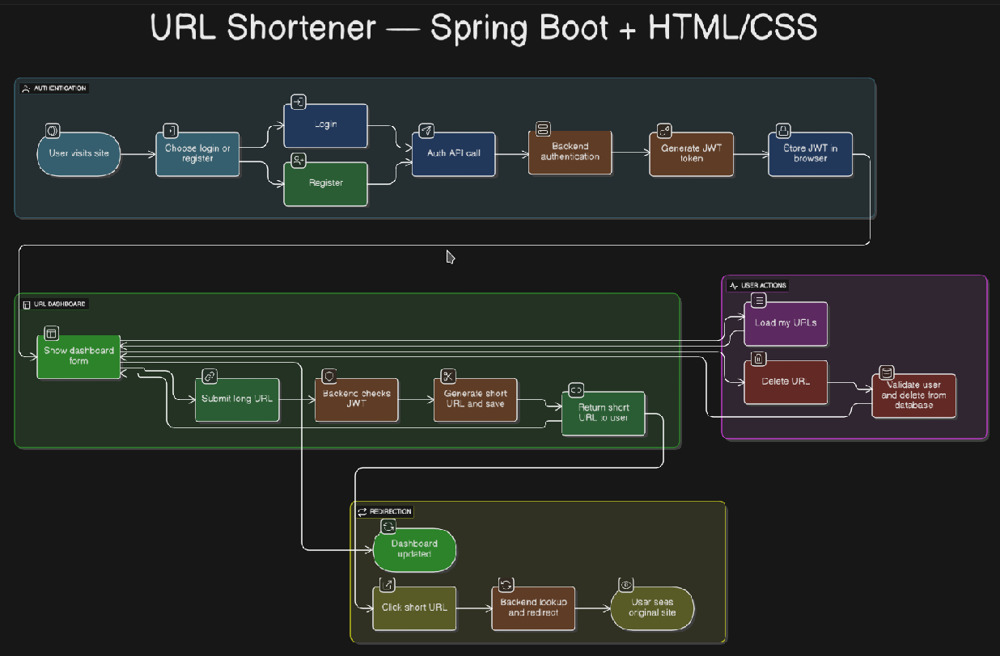

# 🔗 URL Shortener — Spring Boot + HTML/CSS

A simple and secure URL shortening service built using **Spring Boot**, **JWT-based authentication**, and a clean modular architecture. Users can register/login, shorten URLs, manage them via a dashboard, and redirect securely to the original destination.

---

## 📌 Features

- ✅ User registration & login with JWT authentication  
- 🔐 Secure endpoints via token-based access  
- 🔗 Shorten URLs with unique aliases  
- 📋 View & delete shortened URLs  
- 🚀 Redirect to original URLs  
- 🧪 Ready-to-run with Spring Boot  

---

## 🧭 Application Workflow



---

## 📁 Project Structure

├── main
│ ├── java
│ │ └── com.example.urlshortener
│ │ ├── config # SecurityConfig.java
│ │ ├── controller # AuthController, UrlController, etc.
│ │ ├── dto # AuthRequest, UrlResponse, UserDto, etc.
│ │ ├── entity # User, Url
│ │ ├── filter # JwtAuthFilter.java
│ │ ├── repository # UserRepository, UrlRepository
│ │ ├── service # JwtService, UrlService, UserDetailsServiceImpl
│ │ ├── util # UrlshortenerApplication.java
├── test
│ └── java
│ └── com.example.urlshortener
│ └── UrlshortenerApplicationTests.java
├── resources # Application properties & static files
---

## 🛠️ Technologies Used

- **Java 17+**  
- **Spring Boot 3**  
- **Spring Security + JWT**  
- **Spring Data JPA**  
- **Maven**  
- **HTML/CSS (frontend)**  
- **H2/PostgreSQL (configurable)**  

---

## ▶️ Getting Started

### Prerequisites
- Java 17 or later
- Maven

### Steps

```bash
# Clone the repository
git clone https://github.com/yourusername/urlshortener.git
cd urlshortener

# Run the application
./mvnw spring-boot:run
🗃️ Database Entities
User
id

username

password

role

Url
id

shortUrl

longUrl

createdAt

userId

📬 Contribution Guide
Fork this repo

Create a new branch (git checkout -b feature/feature-name)

Make your changes

Push the branch (git push origin feature/feature-name)

Open a Pull Request

👥 Contributors
💻 Team Name: Vibe Coders
Gowtham

Mojesh

Anjali

Gopika

Swapnil

📄 License
This project is licensed under the MIT License.

🙋‍♂️ Contact
Have feedback or questions? Feel free to reach out or open an issue.
